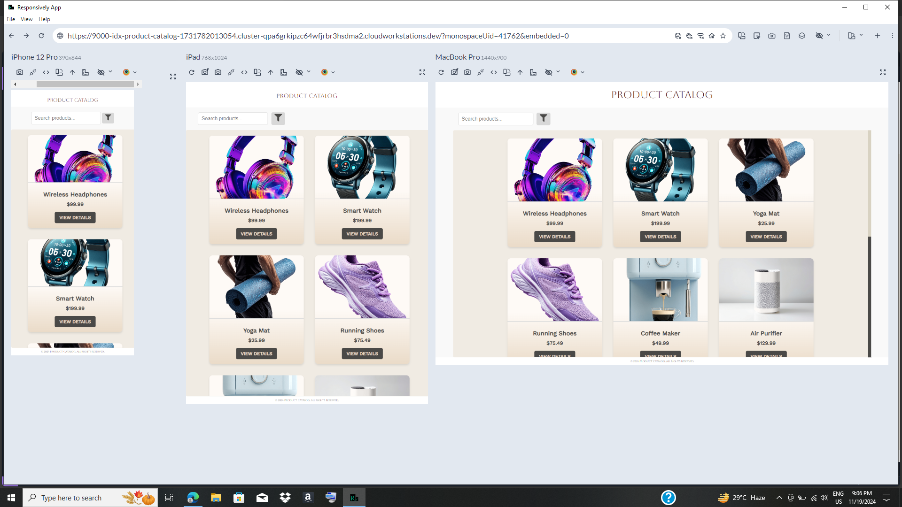
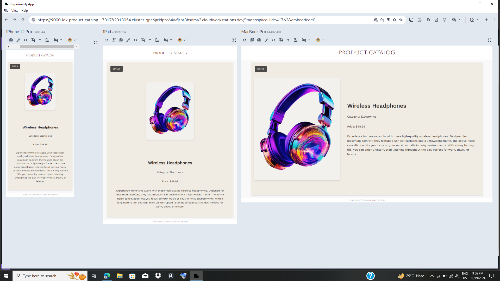

First of all, i am just a beginner reactjs developer with only a 1 year of experience in ReactJS. And i dont have any previous experience in production projects.

I will guide you through this project and how to run this locally. 

This reactjs project is created using Vite, its optimized for a faster development. 

## To run this project locally

### install required dependencies

```npm install```

### To start the local server & to preview

```npm run dev```

### To build (if needed) 

```npm run build```


## Dependencies used

- react
- react-dom
- react-icons
- react-router-dom

### Journey from Information to Working Application 

# Planning:

When it comes to planning, sometimes you might have confusion in where to start. So I just prompted  CHAT GPT to plan a project structure and development flow. By referring the answer I got a full idea on the project development flow. 

# Coding :

After setting up a working model, i got some error when passing props (everytime it was the product.json) it took some hours to finally able get rid of every errors and make a better working model. Yeah I used some help from ChatGPT

# Designing :

I had no idea how does a SAP catalog page is designed, so i started referring so many designs on google. But it was all like multi page and all i have to do was add a product list and car and two components ( search and filter), so managing the empty space wqs hard. So finally i made a basic boxy and flex centered design. 

Then i asked my friends what color they would like to see here, they gave me some and finally i thought luxury palette might be good looking. 

I used [ColorHunt](https://colorhunt.co) to find a good color palette. 
And for fonts i used [Google Fonts](https://fonts.google.com) for some best matching font, yeah definitely luxury ones




